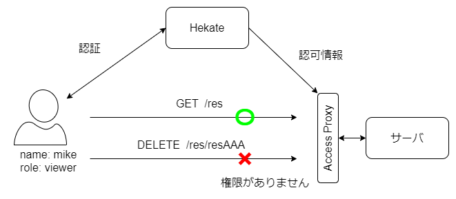

# Hekate

## Overview

`Hekate`はGo言語で記述されたOpenID Connectに対応したシンプルな認証・認可サーバです。  
ユーザー管理と認証・認可処理を実行できます。  
OpenID Connectのことを知らなくても簡単にスケーラブルな認証・認可を行えるシステムを目指しています。

## インストール方法

- All In One環境の構築
  - server, portalを起動

  ```bash
  # SERVER_ADDRはアクセスしたい場所からアクセスできるアドレスにしてください。
  export SERVER_ADDR=localhost

  # この値を指定していない場合はデフォルトの値(admin/password)が使用されます
  export ADMIN_NAME=admin
  export ADMIN_PASSWORD=password

  # デフォルトのport番号以外をbindingする際は、以下の値もdocker起動時に環境変数で指定する必要があります
  #  SERVER_PORT <- API_SERVER側のポート番号を変更したい場合
  #  PORTAL_PORT <- PORTAL側のポート番号を変更したい場合
  # 例として以下ではportalのポート番号を指定します
  export PORTAL_PORT=3000

  docker run -d --name hekate \
    -p $PORTAL_PORT:3000 -p 18443:18443 \
    -e SERVER_ADDR=$SERVER_ADDR \
    -e HEKATE_ADMIN_NAME=$ADMIN_NAME \
    -e HEKATE_ADMIN_PASSWORD=$ADMIN_PASSWORD \
    -e PORTAL_PORT=$PORTAL_PORT \
    smiyoshi/hekate:all-in-one
  ```

  - [http://localhost:3000](http://localhost:3000)へアクセス

- コンポーネントごとにインストール
  - Kubernetesを使用してインストール: [docs/install/kubernetes.md](docs/install/kubernetes.md)

## Hekateでできること

- APIレベルでのアクセス制御
  - 自身のサーバのアクセスをHekateの認証・認可機能と組み合わせて柔軟に制御できます
    
  - 3 minutes Quick Start: [docs/quick_start/access_control.md](docs/quick_start/access_control.md)
- ユーザー管理
  - Hekateの認証機能と組み合わせて、自身のアプリケーションにおけるユーザーの新規追加・ログイン処理を簡単に実装できます
  - 3 minutes Quick Start: [docs/quick_start/user_manage.md](docs/quick_start/user_manage.md)

## ログインページのカスタム

hekateではユーザー認証の際、server上のログイン画面を表示します。  
このログイン画面をカスタマイズし任意の画面を設定できます。  
詳細は[こちら](docs/login_page.md)

## 開発環境

- golang v1.12以上
- MongoDB 4.0以上(※Mongo DBを使用する場合)

## All APIs

[api/api.html](api/api.html)を参照してください。

## Road Map

[TODO List](./todoList.md)を参照してください。

## Author

Shunsuke Miyoshi
